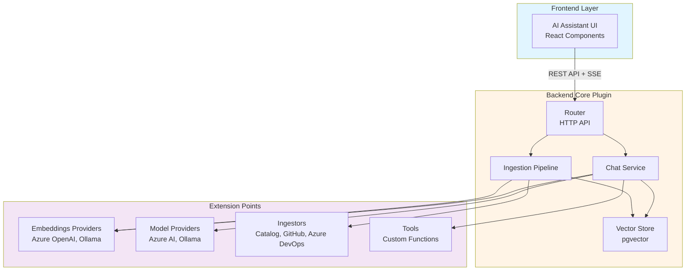

# Backstage Plugin: AI Assistant

[](https://opensource.org/licenses/Apache-2.0)
[](https://nodejs.org)
[](CONTRIBUTING.md)
[](https://backstage.io)

A production-ready Backstage plugin that provides an intelligent AI assistant with Retrieval-Augmented Generation (RAG) capabilities. This plugin enables conversational AI interactions with context from your organization's documentation, code repositories, and catalog entities.

## ✨ Features

- **Multi-Model Support**: Integrate with multiple LLM providers (Azure OpenAI, Ollama, and more)
- **RAG with Vector Search**: Semantic search using pgvector for context-aware responses
- **Pluggable Architecture**: Extensible system for custom ingestors, embeddings providers, and tools
- **Multiple Data Sources**: Ingest from Backstage Catalog, GitHub, Azure DevOps, and custom sources
- **Real-time Streaming**: Live response streaming using Backstage signals
- **Conversation Management**: Persistent chat history and conversation tracking
- **Tool/Function Calling**: Extend AI capabilities with custom tools and functions

## 🚀 Quick Start

### Prerequisites

- Node.js 20 or 22
- PostgreSQL database with pgvector extension
- Backstage instance (compatible with new backend system)

### Installation

1. **Install the packages:**

```bash
# From your Backstage root directory
yarn add @sweetoburrito/backstage-plugin-ai-assistant
yarn add --cwd packages/backend @sweetoburrito/backstage-plugin-ai-assistant-backend
```

2. **Add the frontend plugin to your Backstage app:**

```typescript
// packages/app/src/App.tsx
import { AiAssistantPage } from '@sweetoburrito/backstage-plugin-ai-assistant';

// Add route
<Route path="/ai-assistant" element={<AiAssistantPage />} />;
```

3. **Add the backend plugin:**

```typescript
// packages/backend/src/index.ts
backend.add(import('@sweetoburrito/backstage-plugin-ai-assistant-backend'));

// Add required modules
backend.add(
  import(
    '@sweetoburrito/backstage-plugin-ai-assistant-backend-module-embeddings-provider-azure-open-ai'
  ),
);
backend.add(
  import(
    '@sweetoburrito/backstage-plugin-ai-assistant-backend-module-model-provider-azure-ai'
  ),
);
backend.add(
  import(
    '@sweetoburrito/backstage-plugin-ai-assistant-backend-module-ingestor-catalog'
  ),
);
```

4. **Configure in `app-config.yaml`:**

```yaml
aiAssistant:
  embeddings:
    azureOpenAi:
      deploymentName: 'text-embedding-3-large'
      apiKey: ${AZURE_OPENAI_API_KEY}
      endpoint: https://your-instance.openai.azure.com/
  models:
    azureAi:
      apiKey: ${AZURE_AI_API_KEY}
      models:
        - endpoint: https://your-instance.openai.azure.com/
          modelName: gpt-4
```

5. **Set up the database:**

The plugin will automatically create the required tables with pgvector extension on first run.

For detailed setup instructions, see [Deployment Guide](./docs/deployment.md).

## 📖 Documentation

- **[Architecture Overview](./docs/architecture.md)** - System design, components, and data flow
- **[Configuration Guide](./docs/configuration.md)** - Complete configuration reference
- **[Deployment Guide](./docs/deployment.md)** - Installation and production setup
- **[Custom Ingestor Development](./docs/custom-ingestor.md)** - Build custom data sources
- **[Custom Tool Development](./docs/custom-tools.md)** - Extend AI capabilities with functions
- **[Troubleshooting](./docs/troubleshooting.md)** - Common issues and solutions

## 🏗️ Architecture

The plugin follows a modular architecture with clear separation of concerns:



See the [Architecture Guide](./docs/architecture.md) for detailed information.

## 🔧 Available Modules

### Embeddings Providers

- `ai-assistant-backend-module-embeddings-provider-azure-open-ai` - Azure OpenAI embeddings
- `ai-assistant-backend-module-embeddings-provider-ollama` - Local Ollama embeddings

### Model Providers

- `ai-assistant-backend-module-model-provider-azure-ai` - Azure AI/OpenAI models
- `ai-assistant-backend-module-model-provider-ollama` - Local Ollama models

### Ingestors

- `ai-assistant-backend-module-ingestor-catalog` - Backstage catalog entities
- `ai-assistant-backend-module-ingestor-github` - GitHub repositories
- `ai-assistant-backend-module-ingestor-azure-devops` - Azure DevOps repos

## 🛠️ Development

### Local Development

```bash
# Install dependencies
yarn install

# Start the development environment
yarn start

# Run tests
yarn test

# Lint code
yarn lint:all

# Format code
yarn prettier:write
```

### Project Structure

```
plugins/
├── ai-assistant/                    # Frontend plugin
├── ai-assistant-backend/            # Backend plugin (core)
├── ai-assistant-common/             # Shared types
├── ai-assistant-node/               # Backend interfaces
└── ai-assistant-backend-module-*/   # Backend modules
```

## 🤝 Contributing

We welcome contributions from the community! Whether you're fixing bugs, adding features, improving documentation, or helping other users, your contributions are valued.

### Ways to Contribute

- 🐛 **Report bugs** - Help us identify and fix issues
- ✨ **Suggest features** - Share ideas for new capabilities
- 📖 **Improve docs** - Make our documentation clearer and more comprehensive
- 💻 **Submit code** - Fix bugs, add features, or optimize performance
- 🔍 **Review PRs** - Help review contributions from other developers
- 💬 **Help others** - Answer questions and participate in discussions

### Getting Started

1. Read our [Contributing Guide](CONTRIBUTING.md) for detailed instructions
2. Check out our [Code of Conduct](CODE_OF_CONDUCT.md)
3. Review the [Architecture Documentation](./docs/architecture.md) to understand the system
4. Look for issues labeled `good first issue` or `help wanted`
5. Join discussions and ask questions

### Development Workflow

```bash
# Fork and clone the repository
git clone https://github.com/YOUR_USERNAME/backstage-plugin-ai-assistant.git

# Install dependencies
yarn install

# Start development environment
yarn start

# Run tests
yarn test

# Lint and format code
yarn lint:all
yarn prettier:write
```

For more details, see [CONTRIBUTING.md](CONTRIBUTING.md).

### Project Governance

Learn about our governance model, project roles, and decision-making process in [GOVERNANCE.md](GOVERNANCE.md).

## 📋 Roadmap

### Current Version (0.0.1)

- ✅ Core RAG functionality with pgvector
- ✅ Multi-model support (Azure OpenAI, Ollama)
- ✅ Pluggable architecture with extension points
- ✅ Real-time streaming responses
- ✅ Catalog, GitHub, and Azure DevOps ingestors
- ✅ Conversation management and history

### Planned Features

#### Short Term (Q1 2026)

- 🔄 **Enhanced Tool Support** - More built-in tools for common operations
- 🔄 **Improved UI/UX** - Enhanced chat interface with rich formatting
- 🔄 **Performance Optimization** - Faster vector searches and reduced latency
- 🔄 **Additional Ingestors** - Confluence, Notion, and file system support
- 🔄 **Monitoring & Observability** - Built-in metrics and tracing

#### Medium Term (Q2-Q3 2026)

- 📋 **Multi-tenancy Support** - User and team-specific knowledge bases
- 📋 **Advanced RAG Techniques** - Hybrid search, re-ranking, and query expansion
- 📋 **Model Provider Expansion** - Support for Anthropic, Google Gemini, and more
- 📋 **Conversation Export** - Export conversations for analysis and sharing
- 📋 **Admin Dashboard** - Management UI for configuration and monitoring

#### Long Term (Q4 2026 and beyond)

- 💡 **Fine-tuning Support** - Custom model fine-tuning on organization data
- 💡 **Multi-modal Support** - Image and document understanding
- 💡 **Agent Workflows** - Complex multi-step task automation
- 💡 **Feedback Loop** - User feedback to improve responses
- 💡 **Enterprise Features** - SSO, audit logging, and compliance tools

### Version Compatibility

| Component    | Version      | Status                            |
| ------------ | ------------ | --------------------------------- |
| Node.js      | 20.x, 22.x   | ✅ Supported                      |
| Backstage    | 1.31+        | ✅ Supported (New Backend System) |
| PostgreSQL   | 12+          | ✅ Supported                      |
| pgvector     | 0.5+         | ✅ Supported                      |
| Azure OpenAI | API 2024-02+ | ✅ Supported                      |
| Ollama       | 0.1.0+       | ✅ Supported                      |

See [GitHub Projects](https://github.com/SweetOBurritO/backstage-plugin-ai-assistant/projects) for detailed tracking.

## 📄 License

This project is licensed under the Apache License 2.0 - see the [LICENSE](./LICENSE) file for details.

## 📝 Changelog

For a detailed list of changes, improvements, and bug fixes in each release, see:

- [Backend Plugin Changelog](./plugins/ai-assistant-backend/CHANGELOG.md)
- [Frontend Plugin Changelog](./plugins/ai-assistant/CHANGELOG.md)

## 💬 Support

For issues, questions, or contributions, please:

- Check the [Troubleshooting Guide](./docs/troubleshooting.md)
- Search [existing issues](https://github.com/SweetOBurritO/backstage-plugin-ai-assistant/issues)
- Open a [new issue](https://github.com/SweetOBurritO/backstage-plugin-ai-assistant/issues/new) on GitHub
- Start a [discussion](https://github.com/SweetOBurritO/backstage-plugin-ai-assistant/discussions) for questions
- Refer to the [documentation](./docs/)

---

**Note**: This plugin is production-ready and actively maintained.
