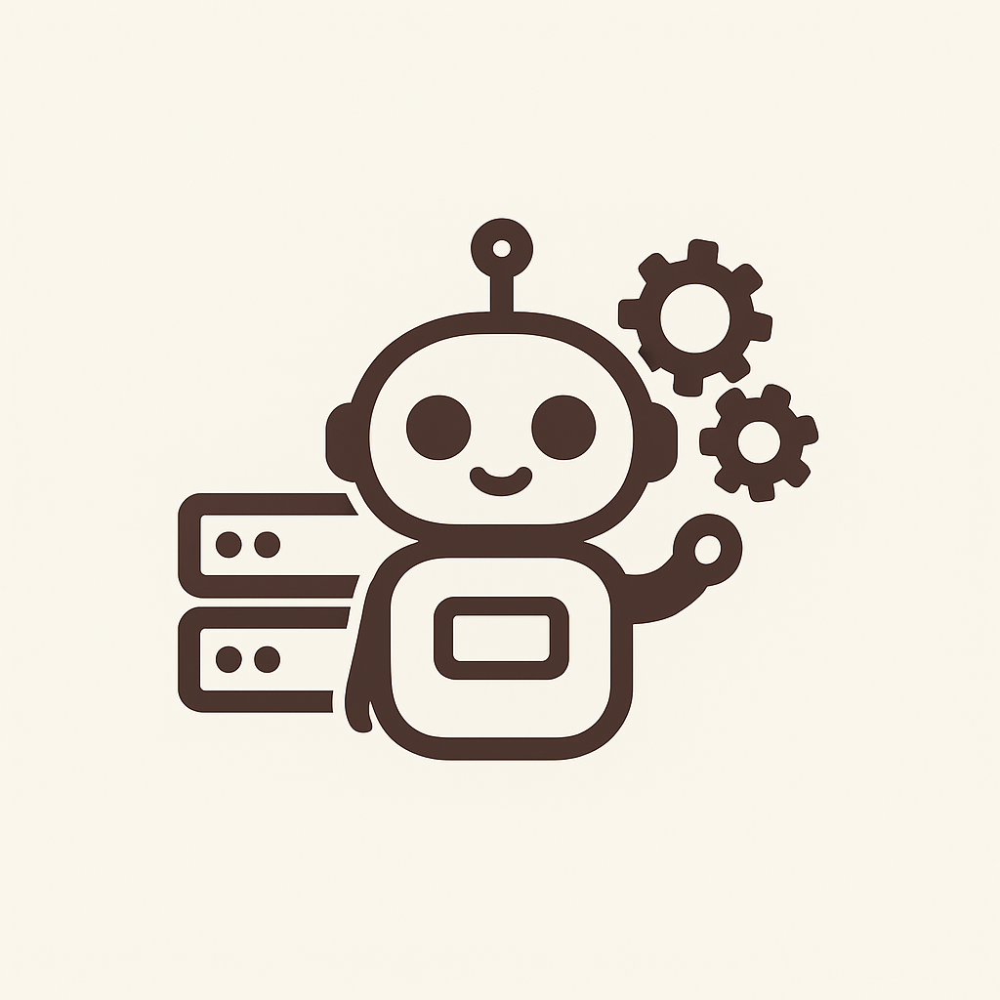

# Backstage Plugin AI Assistant

This repository provides a modular AI Assistant plugin for [Backstage](https://backstage.io/), enabling conversational AI, RAG (Retrieval-Augmented Generation), and tool integrations for developer portals. It supports multiple backend modules for data ingestion, model providers, embeddings, and tool providers.

## Features

- **Conversational AI** - Chat to your assistant directly in backstage and never leave your developer portal.
- **Tool Calling** - Let your AI decide when and how it needs to perform actions or search for new knowledge
- **Modular extensions** - easily add new models, data sources or tools though plugin modules

## Getting Started

See our [installation instructions](docs/index.md)
