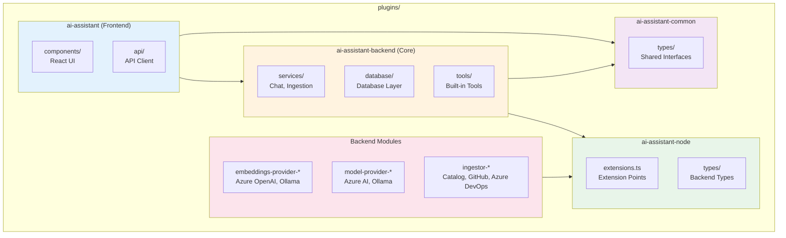

# AI Assistant Plugin Documentation

Welcome to the comprehensive documentation for the Backstage AI Assistant plugin. This documentation is designed for developers and contributors working with or extending the plugin.

## 📚 Documentation Overview

### Getting Started

- **[Main README](../README.md)** - Quick start guide and overview
- **[Deployment Guide](./deployment.md)** - Installation and production setup instructions

### Core Documentation

#### [Architecture Overview](./architecture.md)

Comprehensive guide to the plugin's system design, including:

- High-level architecture and component breakdown
- Core services (Chat, Ingestion, Vector Store)
- Extension points and plugin system
- Data flow for chat and ingestion
- Database schema and technology stack
- Design principles and performance considerations

**Read this to understand how the plugin works internally.**

#### [Configuration Guide](./configuration.md)

Complete reference for configuring the plugin:

- Core configuration (prompts, storage, scheduling)
- Embeddings providers (Azure OpenAI, Ollama)
- Model providers (Azure AI, Ollama)
- Ingestors (Catalog, GitHub, Azure DevOps)
- Environment-specific configuration
- Secret management and security
- Configuration examples for various scenarios

**Read this to configure the plugin for your environment.**

#### [Deployment Guide](./deployment.md)

Production deployment instructions covering:

- Prerequisites and system requirements
- Installation steps (frontend and backend)
- Database setup with pgvector
- Production considerations (performance, security, reliability)
- Deployment methods (Docker, Kubernetes, Cloud platforms)
- Monitoring, backup, and scaling strategies

**Read this to deploy the plugin to production.**

### Developer Guides

#### [Custom Ingestor Development](./custom-ingestor.md)

Step-by-step guide for building custom data sources:

- Ingestor interface and concepts
- Creating basic ingestors
- Advanced patterns (batch processing, pagination, error handling)
- Best practices for document IDs, metadata, and content formatting
- Testing strategies
- Reference implementations

**Read this to integrate custom data sources.**

#### [Custom Tool Development](./custom-tools.md)

Guide for extending AI capabilities with custom tools:

- Tool interface and concepts
- Creating and registering tools
- Advanced patterns (API integration, Backstage integration, complex parameters)
- Best practices for naming, descriptions, and error handling
- Security considerations
- Testing tools

**Read this to add custom functions for the AI assistant.**

### Operations

#### [Troubleshooting Guide](./troubleshooting.md)

Comprehensive troubleshooting reference:

- Quick diagnostics and health checks
- Installation, database, and configuration issues
- Ingestion and runtime problems
- Performance optimization
- API and integration issues
- Debug logging and diagnostic collection

**Read this when encountering problems or errors.**

## 🗺️ Documentation Map

```
backstage-plugin-ai-assistant/
├── README.md                      # Quick start and overview
└── docs/
    ├── README.md                  # This file - documentation index
    ├── architecture.md            # System design and components
    ├── configuration.md           # Configuration reference
    ├── deployment.md              # Production deployment
    ├── custom-ingestor.md         # Build custom data sources
    ├── custom-tools.md            # Build custom AI tools
    └── troubleshooting.md         # Problem resolution
```

## 🎯 Quick Navigation

### I want to...

**...understand how the plugin works**
→ Read [Architecture Overview](./architecture.md)

**...install the plugin**
→ Read [Quick Start](../README.md#quick-start) then [Deployment Guide](./deployment.md)

**...configure embeddings or models**
→ Read [Configuration Guide](./configuration.md)

**...add a new data source**
→ Read [Custom Ingestor Development](./custom-ingestor.md)

**...add custom AI functions**
→ Read [Custom Tool Development](./custom-tools.md)

**...deploy to production**
→ Read [Deployment Guide](./deployment.md)

**...fix an error**
→ Read [Troubleshooting Guide](./troubleshooting.md)

**...contribute code**
→ Read [Architecture](./architecture.md) and [Contributing](../README.md#contributing)

## 📖 Reading Order

### For New Users

1. [Main README](../README.md) - Understand what the plugin does
2. [Architecture Overview](./architecture.md) - Learn how it works
3. [Configuration Guide](./configuration.md) - Set up your environment
4. [Deployment Guide](./deployment.md) - Deploy to production

### For Developers

1. [Architecture Overview](./architecture.md) - Understand system design
2. [Configuration Guide](./configuration.md) - Learn configuration options
3. [Custom Ingestor Development](./custom-ingestor.md) - Extend data sources
4. [Custom Tool Development](./custom-tools.md) - Extend AI capabilities

### For Operators

1. [Deployment Guide](./deployment.md) - Deploy and maintain
2. [Configuration Guide](./configuration.md) - Configure for production
3. [Troubleshooting Guide](./troubleshooting.md) - Resolve issues
4. [Architecture Overview](./architecture.md) - Understand monitoring needs

## 🔑 Key Concepts

### Plugin Architecture

The AI Assistant uses a **modular, extensible architecture** with:

- **Core Plugin**: Handles chat, ingestion, and vector storage
- **Backend Modules**: Extend functionality (providers, ingestors, tools)
- **Extension Points**: Enable plugin development
- **Frontend Plugin**: React-based chat interface

See [Architecture Overview](./architecture.md) for details.

### RAG (Retrieval-Augmented Generation)

The plugin uses **RAG** to ground AI responses in your organization's data:

1. Documents are ingested from various sources
2. Text is chunked and embedded as vectors
3. User queries trigger semantic search
4. Relevant context is provided to the LLM
5. AI generates accurate, contextual responses

### Extension Points

Four extension points enable customization:

- **Data Ingestor**: Add custom data sources
- **Embeddings Provider**: Change embedding models
- **Model Provider**: Add LLM models
- **Tool**: Add AI functions

See [Architecture](./architecture.md#extension-points) for details.

## 🏗️ Project Structure



## 🔗 External Resources

- **Backstage Documentation**: https://backstage.io/docs
- **LangChain Documentation**: https://js.langchain.com/docs
- **pgvector Documentation**: https://github.com/pgvector/pgvector
- **Azure OpenAI Service**: https://azure.microsoft.com/en-us/products/ai-services/openai-service

## 📝 Contributing

We welcome contributions! Please see the [Contributing section](../README.md#contributing) in the main README for guidelines.

Before contributing:

1. Read [Architecture Overview](./architecture.md) to understand the system
2. Check [Custom Ingestor](./custom-ingestor.md) or [Custom Tool](./custom-tools.md) guides for extension development
3. Follow existing code patterns and style

## 📋 Roadmap

The roadmap is maintained in the [main README](../README.md#roadmap).

## 💬 Support

For help:

- Check [Troubleshooting Guide](./troubleshooting.md) for common issues
- Open an issue on GitHub with diagnostic information
- Refer to specific documentation sections above

---

**Last Updated**: October 23, 2025

This documentation covers version 0.0.1 of the AI Assistant plugin. For the latest updates, see the [CHANGELOG](../plugins/ai-assistant-backend/CHANGELOG.md).
