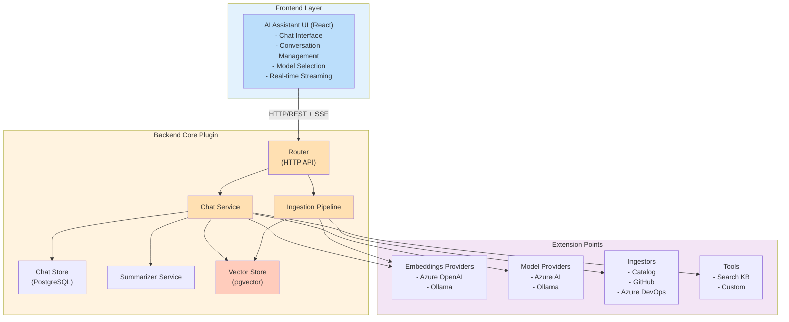
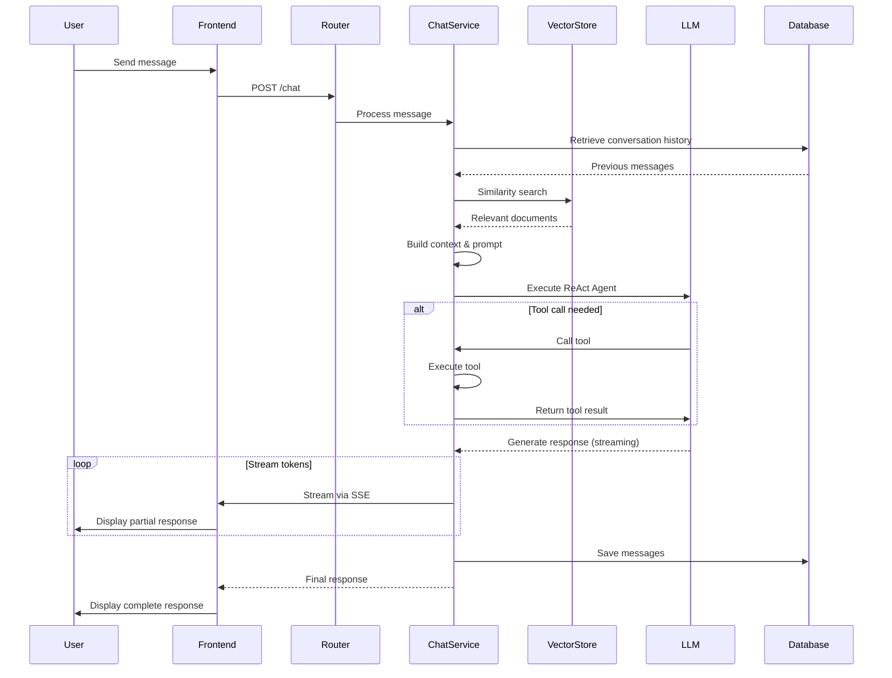
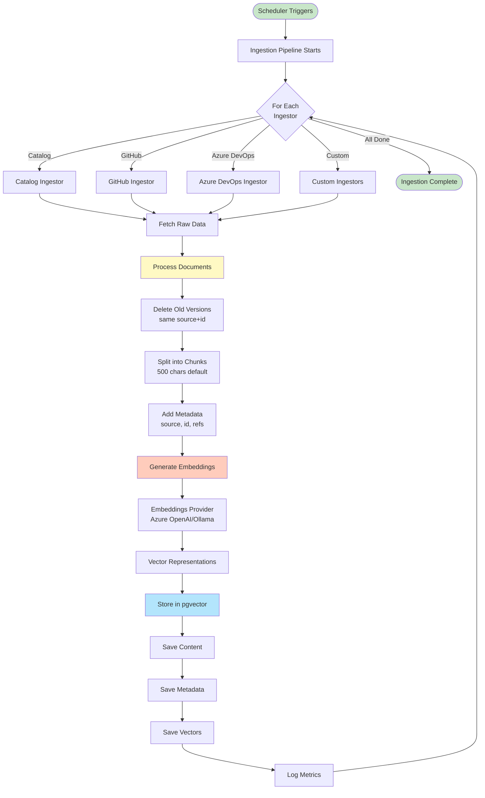
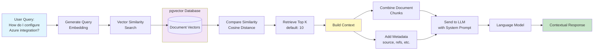

# Architecture Overview

This document provides a comprehensive overview of the AI Assistant plugin architecture, including system design, components, data flow, and extension points.

## Table of Contents

- [System Architecture](#system-architecture)
- [Core Components](#core-components)
- [Extension Points](#extension-points)
- [Data Flow](#data-flow)
- [Database Schema](#database-schema)
- [Technology Stack](#technology-stack)

## System Architecture

The AI Assistant plugin follows a modular, extensible architecture built on Backstage's new backend system. It consists of frontend and backend components that communicate via REST APIs.

### High-Level Architecture



## Core Components

### Frontend Plugin (`ai-assistant`)

The React-based UI that provides the chat interface for end users.

**Key Components:**

- `AiAssistantPage` - Main chat interface
- `Conversation` - Chat message display and conversation management
- `MessageCard` - Individual message rendering
- `ChatApi` - Frontend API client for backend communication

**Responsibilities:**

- Render chat UI
- Handle user input
- Stream responses from backend
- Manage conversation state
- Model selection

### Backend Core Plugin (`ai-assistant-backend`)

The main backend service that orchestrates all AI assistant functionality.

**Key Services:**

#### Router Service

- Exposes REST API endpoints
- Handles HTTP requests/responses
- Implements authentication and authorization
- Supports server-sent events for streaming

**Endpoints:**

```
GET  /models              - List available models
POST /chat                - Send message
GET  /chat/:id           - Get conversation history
GET  /conversations      - List user conversations
```

#### Chat Service

- Manages conversation flow
- Integrates with LLM models
- Retrieves relevant context from vector store
- Handles tool/function calling
- Streams responses via Backstage signals
- Generates conversation summaries

**Key Features:**

- LangChain integration for LLM orchestration
- ReAct agent for tool usage
- Context retrieval from vector store
- Conversation persistence
- Real-time streaming

#### Ingestion Pipeline

- Scheduled data ingestion
- Coordinates multiple ingestors
- Text chunking and splitting
- Batch processing
- Error handling and logging

**Process:**

1. Scheduler triggers ingestion job
2. Each registered ingestor runs
3. Documents are chunked (default 500 chars)
4. Embeddings are generated
5. Vectors are stored in pgvector
6. Old documents are replaced

#### Vector Store (PgVectorStore)

- Manages document embeddings
- Similarity search for RAG
- Document lifecycle management
- Metadata filtering

**Operations:**

- `addDocuments` - Store new embeddings
- `similaritySearch` - Retrieve relevant context
- `deleteDocuments` - Clean up old documents

#### Chat Store

- Persists conversation history
- Message CRUD operations
- Conversation metadata management

#### Summarizer Service

- Generates conversation titles
- Uses LLM to create concise summaries
- Caches results for performance

### Common Package (`ai-assistant-common`)

Shared TypeScript types and utilities used by both frontend and backend.

**Types:**

```typescript
type Message = {
  id?: string;
  role: 'human' | 'ai' | 'tool' | 'system';
  content: string;
  metadata: JsonObject;
};

type Conversation = {
  id: string;
  userRef: string;
  title: string;
};
```

### Node Package (`ai-assistant-node`)

Backend-specific types, interfaces, and extension points for building modules.

**Core Interfaces:**

- `Ingestor` - Data source integration
- `EmbeddingsProvider` - Embedding generation
- `Model` - LLM model wrapper
- `Tool` - AI function/tool definition
- `VectorStore` - Vector database interface

## Extension Points

The plugin uses Backstage's extension point system to enable modularity and extensibility.

### 1. Data Ingestor Extension Point

Allows registration of custom data sources.

```typescript
export const dataIngestorExtensionPoint =
  createExtensionPoint<DataIngestorExtensionPoint>({
    id: 'ai-assistant.data-ingestor',
  });
```

**Interface:**

```typescript
type Ingestor = {
  id: string;
  ingest: (options: IngestorOptions) => Promise<EmbeddingDocument[] | void>;
};
```

**Example Usage:**

```typescript
dataIngestor.registerIngestor({
  id: 'my-custom-ingestor',
  ingest: async ({ saveDocumentsBatch }) => {
    const documents = await fetchMyData();
    await saveDocumentsBatch(documents);
  },
});
```

### 2. Embeddings Provider Extension Point

Allows registration of embedding generation services.

```typescript
export const embeddingsProviderExtensionPoint =
  createExtensionPoint<EmbeddingsProviderExtensionPoint>({
    id: 'ai-assistant.embeddings-provider',
  });
```

**Interface:**

```typescript
type EmbeddingsProvider = {
  getEmbeddings: () => Promise<Embeddings>;
};
```

**Note:** Only one embeddings provider can be registered per instance.

### 3. Model Provider Extension Point

Allows registration of LLM models.

```typescript
export const modelProviderExtensionPoint =
  createExtensionPoint<ModelProviderExtensionPoint>({
    id: 'ai-assistant.model-provider',
  });
```

**Interface:**

```typescript
type Model = {
  id: string;
  chatModel: BaseChatModel; // LangChain chat model
};
```

**Example:**

```typescript
modelProvider.register({
  id: 'gpt-4',
  chatModel: new ChatOpenAI({ modelName: 'gpt-4' }),
});
```

### 4. Tool Extension Point

Allows registration of custom tools/functions for the AI.

```typescript
export const toolExtensionPoint = createExtensionPoint<ToolExtensionPoint>({
  id: 'ai-assistant.tool',
});
```

**Interface:**

```typescript
type Tool<T extends ZodType> = {
  name: string;
  description: string;
  schema: T;
  func: (input: z.infer<T>, context: ToolContext) => Promise<string>;
};
```

## Data Flow

### Chat Flow



### Ingestion Flow



### RAG Context Retrieval



## Database Schema

### Tables

#### `embeddings`

Stores vector embeddings for RAG.

```sql
CREATE TABLE embeddings (
  id UUID PRIMARY KEY DEFAULT uuid_generate_v4(),
  content TEXT NOT NULL,
  metadata JSONB NOT NULL,
  vector VECTOR NOT NULL
);
```

**Columns:**

- `id` - UUID primary key
- `content` - Text content of the chunk
- `metadata` - JSON metadata including:
  - `source` - Ingestor ID (e.g., 'catalog', 'github')
  - `id` - Source document ID
  - `chunk` - Chunk number
  - Custom metadata from ingestors
- `vector` - Embedding vector (dimensions based on model)

**Indexes:**

- Primary key on `id`
- Vector similarity index for efficient search

#### `conversation`

Stores chat message history.

```sql
CREATE TABLE conversation (
  id UUID PRIMARY KEY,
  conversation_id TEXT NOT NULL,
  role TEXT NOT NULL,
  content TEXT NOT NULL,
  userRef TEXT NOT NULL,
  created_at TIMESTAMP NOT NULL DEFAULT NOW()
);
```

**Columns:**

- `id` - Message UUID
- `conversation_id` - Groups messages into conversations
- `role` - Message role (human, ai, tool, system)
- `content` - Message text
- `userRef` - Backstage user entity reference
- `created_at` - Timestamp

**Indexes:**

- Primary key on `id`
- Index on `conversation_id` for efficient retrieval
- Index on `userRef` for user-specific queries

#### `conversations`

Stores conversation metadata.

```sql
CREATE TABLE conversations (
  id TEXT PRIMARY KEY,
  userRef TEXT NOT NULL,
  title TEXT NOT NULL,
  created_at TIMESTAMP NOT NULL DEFAULT NOW(),
  updated_at TIMESTAMP NOT NULL DEFAULT NOW()
);
```

**Columns:**

- `id` - Conversation ID
- `userRef` - Owner user reference
- `title` - Generated conversation title
- `created_at` - Creation timestamp
- `updated_at` - Last message timestamp

#### `tools`

Stores custom tool definitions (if applicable).

```sql
-- Schema varies based on implementation
```

## Technology Stack

### Frontend

- **React** - UI framework
- **Backstage Core** - Plugin system and APIs
- **TypeScript** - Type safety

### Backend

- **Node.js** - Runtime
- **Backstage Backend System** - Plugin framework
- **LangChain** - LLM orchestration
  - LangGraph - Agent framework
  - Text Splitters - Document chunking
- **PostgreSQL** - Database
- **pgvector** - Vector similarity search
- **Knex.js** - Database migrations and queries

### AI/ML

- **Azure OpenAI** - Embeddings and LLM models
- **Ollama** - Local model support
- **LangChain** - Abstraction layer

### Development

- **TypeScript** - Language
- **Yarn Workspaces** - Monorepo management
- **Jest** - Testing
- **ESLint** - Linting
- **Prettier** - Code formatting
- **Changesets** - Version management

## Design Principles

### 1. Modularity

- Core plugin provides foundation
- Modules extend functionality
- Clear extension points
- Loose coupling between components

### 2. Extensibility

- Plugin-based architecture
- Multiple ingestors, models, providers supported
- Custom tools and functions
- Configuration-driven behavior

### 3. Scalability

- Async processing with scheduler
- Batch processing for ingestion
- Vector search for efficient retrieval
- Caching for performance

### 4. Security

- Backstage authentication integration
- User-scoped conversations
- Secure credential management
- Permission-aware operations

### 5. Observability

- Comprehensive logging
- Error tracking
- Ingestion metrics
- Performance monitoring

## Performance Considerations

### Vector Search Optimization

- Index configuration for similarity search
- Configurable result limits (default: 10 docs)
- Metadata filtering to reduce search space

### Chunking Strategy

- Default chunk size: 500 characters
- Chunk overlap: 50 characters
- Balance between context and granularity

### Caching

- Conversation summaries cached
- Embeddings cached by content hash
- Model responses cached when appropriate

### Streaming

- Real-time response streaming reduces perceived latency
- Backstage signals for efficient WebSocket communication
- Progressive rendering of responses

## Future Architecture Considerations

- **Multi-tenancy**: Namespace isolation for different teams
- **Distributed Processing**: Queue-based ingestion for scale
- **Hybrid Search**: Combine vector and keyword search
- **Fine-tuning**: Custom model training on organization data
- **Analytics**: Usage tracking and insights dashboard

---

For implementation details of specific components, see:

- [Configuration Guide](./configuration.md)
- [Custom Ingestor Development](./custom-ingestor.md)
- [Custom Tool Development](./custom-tools.md)
